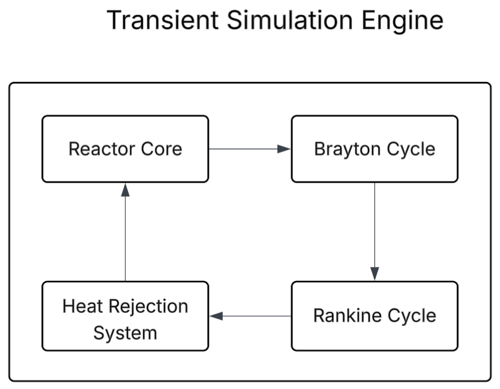

# HTGR Combined Cycle Power Plant Simulator

A Python-based simulation designed to model the thermal transients of a High-Temperature Gas-Cooled Reactor (HTGR) and its associated power conversion systems. The model integrates a primary Brayton Gas Cycle with a bottoming Rankine Steam Cycle to analyze overall plant performance.

The simulation models a triple-loop energy conversion system. Heat generated in the nuclear core is transferred through a series of thermodynamic cycles to maximize total plant efficiency.

## Core Features

* **Thermal Transient Modeling:** Simulates reactor power and temperature changes during startup and operation.
* **Combined Cycle Analysis:** Models energy transfer between the gas-cooled core and the dual-cycle power generation system.
* **Performance Optimization:** Includes optimized steam property lookups (IAPWS-97) and configurable simulation time-steps for efficient execution.
* **PEP 8 & Type Hinting:** Adheres to PEP 8 formatting standards and utilizes PEP 484 type hints to ensure codebase consistency and robust static analysis.

## How it Works



The simulator models the flow of energy through three primary stages, following the path shown in the architecture diagram:

### 1. Heat Generation (The Core)
The simulation begins in the **Reactor Core**. 
* **Startup Physics:** The reactor follows a flow-driven startup where the helium mass flow increases first, followed by a delayed increase in thermal power.
* **Energy Transfer:** The core heats the circulating helium gas to a target temperature. This thermal power is the "input" for the rest of the system.

### 2. Primary Power (Brayton Cycle)
The hot helium from the core enters the **Brayton Cycle** (Gas Turbine).
* **Work Extraction:** The gas expands through a turbine to generate electricity based on the cycle's pressure ratio and thermal efficiency.
* **Heat Recovery:** The exhaust heat leaving the gas turbine is recovered and passed down to the next stage to avoid energy waste.

### 3. Secondary Power (Rankine Cycle)
The **Rankine Cycle** (Steam Turbine) acts as a "bottoming cycle" to capture the remaining energy.
* **Steam Generation:** The hot exhaust from the gas cycle is used to boil water into high-pressure steam.
* **Final Conversion:** This steam spins a second turbine to generate additional power, increasing total plant efficiency.

### 4. Heat Rejection
Any final leftover heat is rejected through a cooling system, which incurs a small "parasitic" power penalty for running fans.

## Installation & Usage

1.  **Clone the repository:**
    ```bash
    git clone [https://github.com/ibaadm/HTGR-Simulator.git](https://github.com/ibaadm/HTGR-Simulator.git)
    cd HTGR-Simulator
    ```

2.  **Create and activate a virtual environment:**
    ```bash
    python -m venv .venv
    # Windows:
    .venv\Scripts\activate
    # Mac/Linux:
    source .venv/bin/activate
    ```

3.  **Install dependencies:**
    ```bash
    # Standard Setup (For Users)
    pip install .
    # Development Setup (For Contributors)
    pip install -e ".[dev]"
    ```

4. **Execute the simulation and generate results:**
    ```bash
    python main.py
    ```

